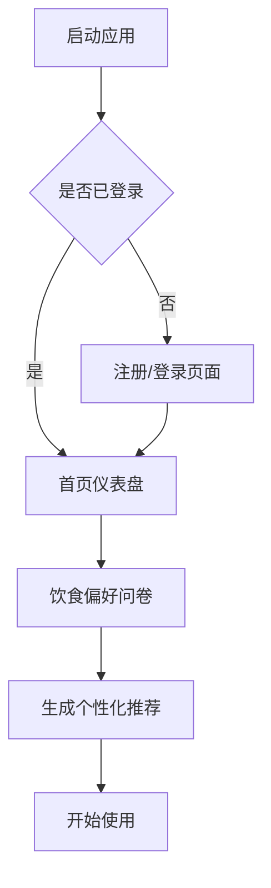
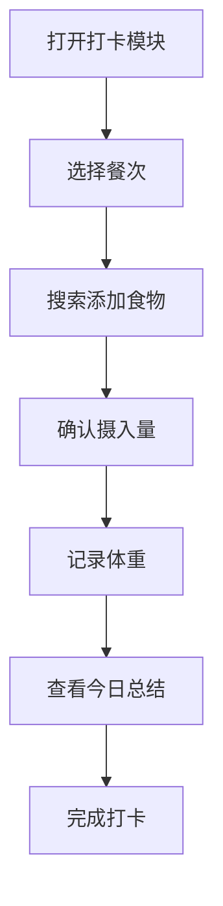
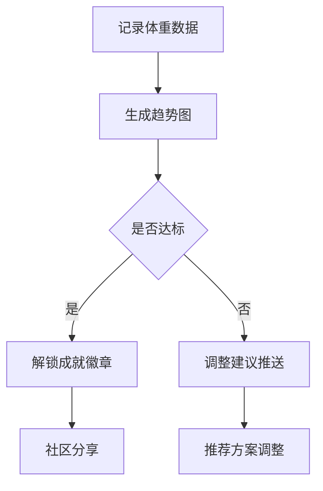

# 体重管理应用 - 产品需求文档

## 1. 产品概述

一款专注于体重管理的沉浸式应用，为减肥和健身人群提供完整的饮食记录、身体数据追踪、个性化推荐及社区互动体验。

### 产品愿景
帮助用户科学管理体重，通过个性化饮食推荐和进度追踪，让减肥健身过程更加科学、有趣且充满成就感。

### 目标用户
- 减肥人群
- 健身爱好者
- 追求健康饮食的用户

## 2. 核心功能

### 2.1 用户角色

| 角色 | 注册方式 | 核心权限 |
|------|----------|----------|
| 访客 | 无需注册 | 浏览公开内容、查看菜谱 |
| 注册用户 | 手机号/邮箱注册 | 完整功能使用、个性化推荐、数据分析 |
| VIP用户 | 付费升级 | 高级菜谱、专属营养师建议、无广告 |

### 2.2 功能模块

1. **首页/仪表盘**
   - 今日摄入热量概览
   - 体重趋势图
   - 快速打卡入口
   - 推荐内容卡片

2. **食物库**
   - 食物搜索与分类浏览
   - 详细营养成分展示（热量、蛋白质、脂肪、碳水、纤维等）
   - 食物收藏功能
   - 最近食用记录

3. **饮食打卡**
   - 早餐/午餐/晚餐/加餐分类记录
   - 食物搜索添加
   - 自定义份量设置
   - 拍照上传功能
   - 每日营养摄入统计

4. **体重追踪**
   - 每日体重记录
   - 体重变化曲线图
   - 目标进度展示
   - BMI计算与评估

5. **问卷调查与个性化推荐**
   - 饮食偏好问卷（口味、过敏原、饮食习惯）
   - 目标设定（减肥/增肌/维持）
   - 基于问卷的食物推荐
   - 学习路径推荐

6. **菜谱推荐**
   - 减脂菜谱分类
   - 健身营养餐推荐
   - 菜谱详情（食材、步骤、营养）
   - 收藏与计划功能

7. **社区与成就**
   - 动态分享
   - 话题讨论
   - 用户互动（点赞、评论、关注）
   - 成就徽章系统
   - 每日任务与打卡挑战

8. **附近美食推荐**
   - 基于用户定位获取周边餐饮商家
   - 商家分类筛选（轻食、沙拉、小火锅、粥店等）
   - 商家菜品营养信息展示（热量、脂肪、碳水等）
   - 根据用户口味偏好智能排序推荐
   - 外卖平台入口跳转
   - 外食热量记录功能（帮助用户在外食时仍能管理热量摄入）
   - 热门健康餐厅推荐榜单

9. **个人中心**
   - 用户资料管理
   - 目标设置与调整
   - 饮食偏好设置
   - 数据统计报告
   - 设置与偏好

## 3. 核心流程

### 3.1 用户注册流程

### 3.2 每日打卡流程

### 3.3 进度追踪流程

## 4. 用户界面设计

### 4.1 设计风格

**主题定位：清新自然 + 活力健康**

- **主色调**：薄荷绿 `#4ECDC4` 传递清新健康感
- **辅助色**：珊瑚橙 `#FF6B6B` 用于强调和激励
- **背景色**：米白 `#FAF9F7` 营造温和舒适氛围
- **深色背景**：`#1A1A2E` 用于数据可视化区域

**字体选择**
- 标题：`"Noto Sans SC", "PingFang SC", sans-serif` - 700/600 weight
- 正文：`"Noto Sans SC", "PingFang SC", sans-serif` - 400 weight
- 数字强调：`"DIN Alternate", "Roboto", sans-serif` - 用于数据展示

**按钮风格**
- 圆角卡片式按钮（border-radius: 16px）
- 渐变背景配合阴影
- 悬停状态：轻微上浮 + 阴影加深

**图标风格**
- 使用线性图标为主
- 统一 stroke-width: 2px
- 圆润边角

### 4.2 页面设计概览

| 页面 | 主要模块 | UI元素 |
|------|----------|--------|
| 首页 | 热量卡片、体重趋势、快捷打卡、推荐内容 | 渐变卡片、圆形进度环、折线图、轮播卡片 |
| 食物库 | 搜索栏、分类标签、食物列表、营养详情 | 搜索框、Tabs切换、食物卡片弹窗 |
| 打卡 | 餐次选择、食物添加、数量设置、拍照 | 分段控件、食物搜索列表、数量滚轮、相机图标 |
| 体重追踪 | 体重录入、数据图表、目标进度 | 大数字展示、曲线图、进度条、徽章 |
| 附近美食 | 地图视图、商家列表、口味筛选、营养标签 | 地图标记、商家卡片、筛选标签、营养徽章 |
| 社区 | 动态流、话题栏、互动区、成就展示 | 卡片列表、标签栏、点赞动画、徽章墙 |
| 个人中心 | 头像信息、统计数据、菜单列表 | 头像卡片、图表组件、列表菜单 |

### 4.3 响应式策略

- **桌面端**：双栏/三栏布局，充分利用屏幕空间
- **平板端**：自适应栏宽，保持阅读舒适度
- **移动端**：单栏布局，底部导航栏，触摸友好的大按钮

### 4.4 动效设计

- **页面切换**：淡入淡出 + 轻微位移（300ms ease-out）
- **数据更新**：数字滚动动画
- **打卡完成**：庆祝动画 + 粒子效果
- **成就解锁**：徽章发光 + 弹跳效果
- **加载状态**：骨架屏 + 渐变闪烁

## 5. 数据统计与内容指标

### 5.1 食物库数据

- 收录常见食物 500+ 种
- 覆盖中餐、西餐、小吃零食
- 完整营养成分数据

### 5.2 菜谱数据

- 减脂菜谱 100+ 道
- 健身营养餐 80+ 道
- 每道菜谱包含完整食材、步骤、营养分析

### 5.3 成就徽章

- 打卡类：连续7天、30天、100天
- 减重类：减重5kg、10kg、20kg
- 饮食类：均衡饮食达人、热量控制专家
- 社区类：热心互助、知识达人

## 6. 隐私与数据安全

- 用户数据加密存储
- 密码加密处理
- 敏感操作需二次验证
- 数据导出功能
