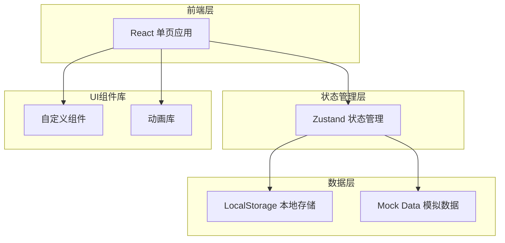

# 体重管理应用 - 技术架构文档

## 1. 架构设计



## 2. 技术选型

| 技术 | 版本 | 用途 |
|------|------|------|
| React | 18.x | 前端框架 |
| Vite | 5.x | 构建工具 |
| TailwindCSS | 3.x | 样式框架 |
| Zustand | 4.x | 状态管理 |
| React Router | 6.x | 路由管理 |
| Lucide React | 最新 | 图标库 |
| Recharts | 2.x | 图表组件 |
| Framer Motion | 11.x | 动画库 |

## 3. 路由定义

| 路由 | 页面 | 功能描述 |
|------|------|----------|
| `/` | 首页/仪表盘 | 今日概览、快速入口、推荐内容 |
| `/foods` | 食物库 | 食物搜索、分类浏览、营养详情 |
| `/checkin` | 饮食打卡 | 餐次记录、食物添加、拍照上传 |
| `/weight` | 体重追踪 | 体重记录、趋势图表、目标进度 |
| `/recipes` | 菜谱推荐 | 减脂菜谱、健身餐、菜谱详情 |
| `/nearby` | 附近美食 | 商家列表、口味筛选、营养标签、外卖跳转 |
| `/community` | 社区 | 动态流、话题讨论、成就展示 |
| `/profile` | 个人中心 | 资料管理、数据统计、设置 |
| `/login` | 登录页 | 用户登录 |
| `/register` | 注册页 | 新用户注册 |
| `/questionnaire` | 问卷调查 | 饮食偏好问卷 |

## 4. 数据模型

### 4.1 用户数据模型

```typescript
interface User {
  id: string;
  nickname: string;
  avatar: string;
  email?: string;
  phone?: string;
  goal: 'lose_weight' | 'maintain' | 'gain_muscle';
  targetWeight: number;
  currentWeight: number;
  height: number;
  preferences: FoodPreference;
  createdAt: string;
}
```

### 4.2 食物数据模型

```typescript
interface Food {
  id: string;
  name: string;
  nameEn?: string;
  category: string;
  calories: number; // kcal per 100g
  protein: number; // g per 100g
  fat: number; // g per 100g
  carbs: number; // g per 100g
  fiber: number; // g per 100g
  unit: string; // 计量单位
  servingSize: number; // 克数/份
}
```

### 4.3 打卡记录数据模型

```typescript
interface CheckInRecord {
  id: string;
  date: string; // YYYY-MM-DD
  meals: {
    breakfast: MealItem[];
    lunch: MealItem[];
    dinner: MealItem[];
    snack: MealItem[];
  };
  weight?: number;
  photoUrl?: string;
}
```

### 4.4 体重记录数据模型

```typescript
interface WeightRecord {
  id: string;
  date: string;
  weight: number;
  note?: string;
}
```

### 4.5 商家数据模型

```typescript
interface Merchant {
  id: string;
  name: string;
  category: string; // 轻食/沙拉/小火锅/粥店/日料/西餐等
  address: string;
  distance: number; // 距离用户的位置，单位：米
  rating: number; // 评分 1-5
  caloriesRange: string; // 如 "300-500kcal"
  avgCalories: number;
  avgProtein: number;
  avgFat: number;
  avgCarbs: number;
  tags: string[]; // 健康、低脂、高蛋白等标签
  tasteProfile: string[]; // 清淡、重口、麻辣等
  priceRange: string; // ¥/¥¥/¥¥¥
  openingHours: string;
  imageUrl: string;
  deliveryPlatforms: string[]; // 支持的外卖平台
}
```

## 5. 核心功能模块

### 5.1 食物库模块
- 食物搜索（支持中文、拼音首字母）
- 分类筛选（主食、蔬菜、水果、肉类、饮品等）
- 营养成分排序
- 收藏功能

### 5.2 打卡模块
- 餐次时间自动识别
- 份量精确设置
- 今日营养摄入统计
- 打卡日历视图

### 5.3 进度追踪模块
- 体重趋势折线图
- BMI 计算与状态提示
- 目标完成百分比
- 周/月/年视图切换

### 5.4 个性化推荐模块
- 问卷数据收集
- 基于偏好的食物过滤
- 学习路径生成
- 定期推荐刷新

### 5.5 社区模块
- 动态发布与展示
- 话题分类与搜索
- 点赞、评论、关注
- 成就徽章展示

### 5.6 成就系统
- 打卡连续天数徽章
- 减重里程碑徽章
- 饮食均衡徽章
- 社区活跃徽章

### 5.7 附近美食模块
- 定位获取用户位置
- 商家列表按距离/评分/热量排序
- 分类筛选（轻食、沙拉、粥店、日料等）
- 口味偏好匹配（清淡、重口、麻辣等）
- 商家营养数据展示
- 外卖平台跳转链接
- 外食热量快捷记录

## 6. Mock 数据

应用内置 Mock 数据包括：
- 食物库：50+ 种常见食物
- 菜谱库：20+ 道推荐菜谱
- 商家库：30+ 家附近餐饮商家
- 成就徽章：15+ 种成就
- 社区话题：10+ 个话题

## 7. 项目结构

```
/workspace/
├── index.html
├── package.json
├── vite.config.js
├── tailwind.config.js
├── postcss.config.js
├── src/
│   ├── main.jsx
│   ├── App.jsx
│   ├── index.css
│   ├── components/
│   │   ├── Layout/
│   │   ├── Common/
│   │   └── Features/
│   ├── pages/
│   │   ├── Home/
│   │   ├── Foods/
│   │   ├── CheckIn/
│   │   ├── Weight/
│   │   ├── Recipes/
│   │   ├── Nearby/
│   │   ├── Community/
│   │   └── Profile/
│   ├── store/
│   │   └── useStore.js
│   ├── data/
│   │   └── mockData.js
│   ├── utils/
│   │   └── helpers.js
│   └── router/
│       └── index.jsx
└── .trae/
    └── documents/
        ├── PRD-体重管理应用.md
        └── README.md
```
